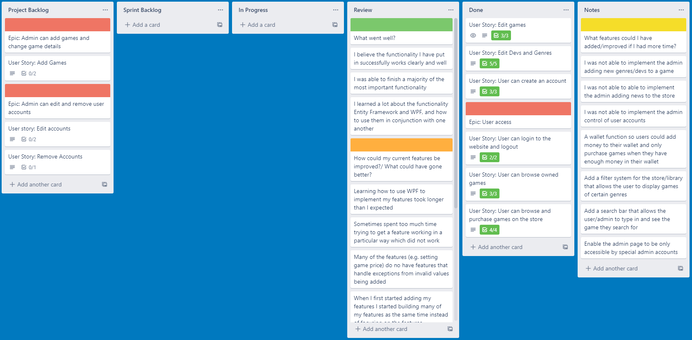
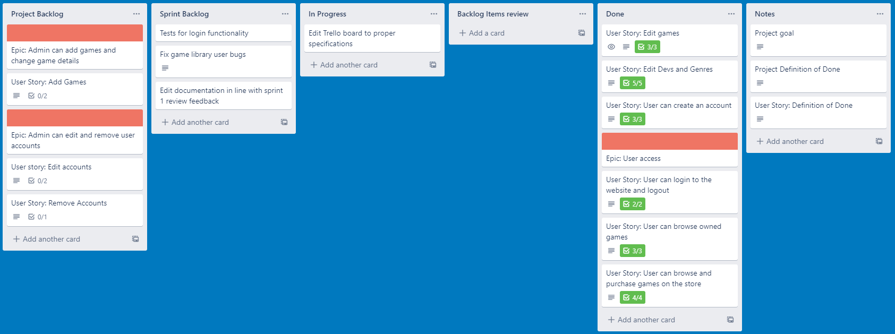
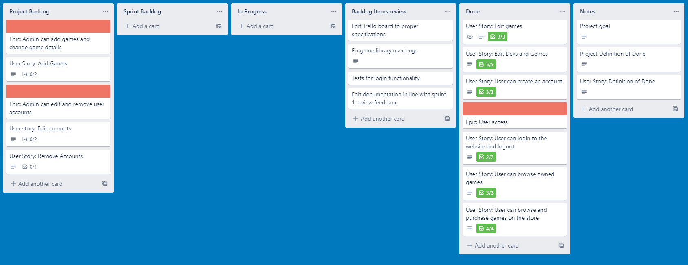
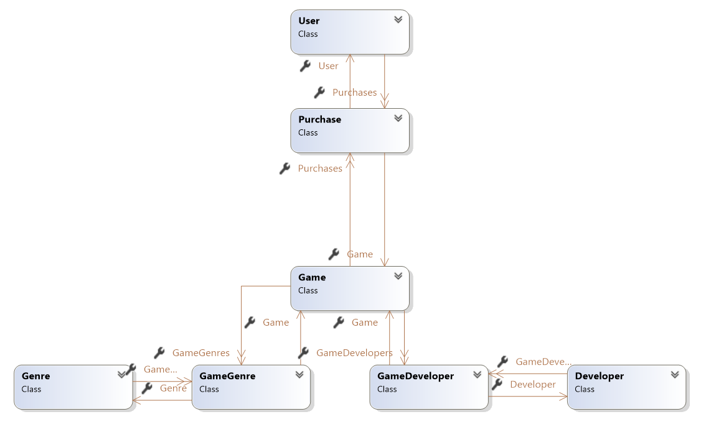

My 3-tier individual project for an online game’s marketplace

Project Goal:
The goal for my 3-tier application is to create a games marketplace where a user can create an account, allowing them to look through a store selection of games and "purchase" any they are interested in, which are then transferred for that user to their library where they would be able to view the game they acquired.

Additionally, an admin will be able to login to create new game entries for the store, as well as editing and delete current entries, as well as having some power to view and change registered accounts.

#### Definition of done:
- CRUD Method are working as intended
- Unit tests for functionality are created and pass
- Required documentation is up to date
- GUI is tested an works as intended

#### Output of Sprint Review:
- User could successfully browse signup, login, library and store pages
- User could browse through the selection of games and purchase a game to add to their library
- Admin could make changes to all the different details of each game
- Admin could make changes to the list of available developers and genres

#### Sprint 2 Goal:

- Update documentation to meet feedback 
- Edit trello board to correct board format and to include correct items
- Fix bugs present in correct user being logged in for login system
- Create tests for login system to make sure it works correctly

#### Project Retrospective:

#### What I have learned:
-	I learned a lot about the functionality Entity Framework and WPF, and how to use them in conjunction with one another.
-   Learned about how to use a kanban board to organise all elements that are involved in the sprint
-   Learned about some differences of using model first vs database first frameworks.
-   Gained experience in designing relationships between database effectively.

#### Next time I would:
- Before I start constructing my database, decide whether database or model first would be better for my project and make sure that is correct so there is no need to change.
- Create my user stories at the beginning of project before I began coding the features needed.
- Make sure I take into account the definition of done when constructing the user stories and the features.

#### Sprint Retrospective

##### What could be better:
-	Learning how to use WPF to implement my features took longer than I expected.
-	I sometimes spent too much time trying to get a feature working in a particular way which did not work.
-	Many of the features (e.g., setting game price) do not have features that handle exceptions from invalid values being added.
-	I started with more complex features, causing me to spend a lot of time trying to get those working before I realised, I should start on the simpler features and get those done first, so I do not end up wasting too much time on the areas I struggle on and not leaving enough time for the simpler tasks.
-	I started with model first but found I struggle to work with join tables with model first, and so restarted to implement database first which took additional time away from development.
-	Trello board was not utilised or organised correctly for sprint 1.

##### What went well:
-	I believe the functionality I have put in successfully works clearly and well.
-	I was able to finish a majority of the most important functionality.
-	Switching from model first to database first for my project helped understand how to move forward with my project.

##### Action Plan:
-	Add other types of tasks to the sprint backlog (e.g. big fixing) other than user stories.
-	Create more defined order for creating the features, ahead of time.
- Work on the more simple/easier to implement features first.
- If I have struggle to get anywhere on implementing a feature, try working on a separate feature and come back later to the feature I'm struggling with.
 - Put required elements in trello board correctly at the beginning of the project.

#### Trello board - End of Sprint 1:

#### Trello board - Beginning of Sprint 2:

#### Trello board - End of Sprint 2:

#### User guide:
-	When the project is opened, connection between the database and model has already been setup, so to start using the application all the user needs to do is run the application with the WPF project as the start-up project.
-	From there the user can interact with the application as intended, first clicking on the “Create account” button to make an account for themselves, before navigating back to the login page where they can enter their account details and enter the application to access its full user features.

#### Class Diagram:

Genre and Developer are connected to the game class using join tables to avoid having a direct many to many relationship between the tables

[Link to Trello board](https://trello.com/b/ieQGAace/3-layer-project)
