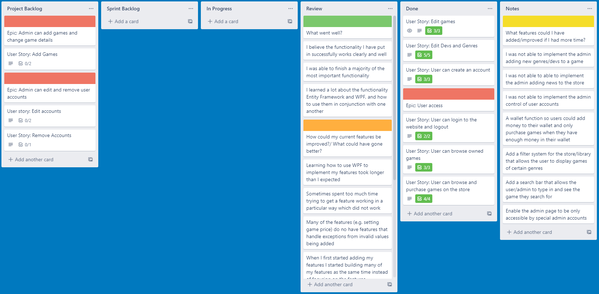
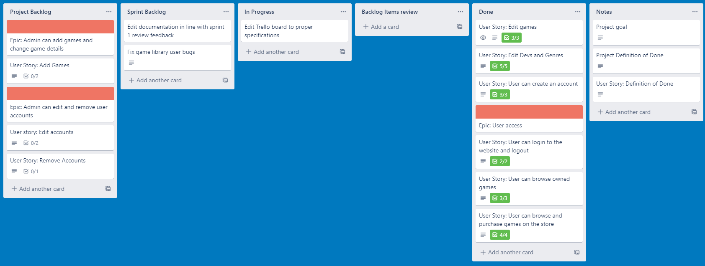
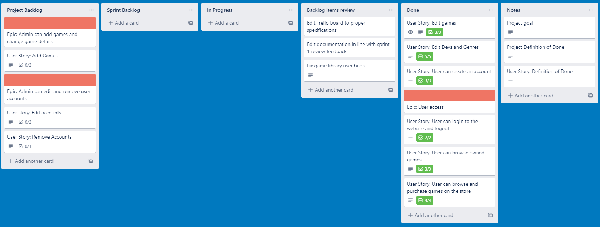
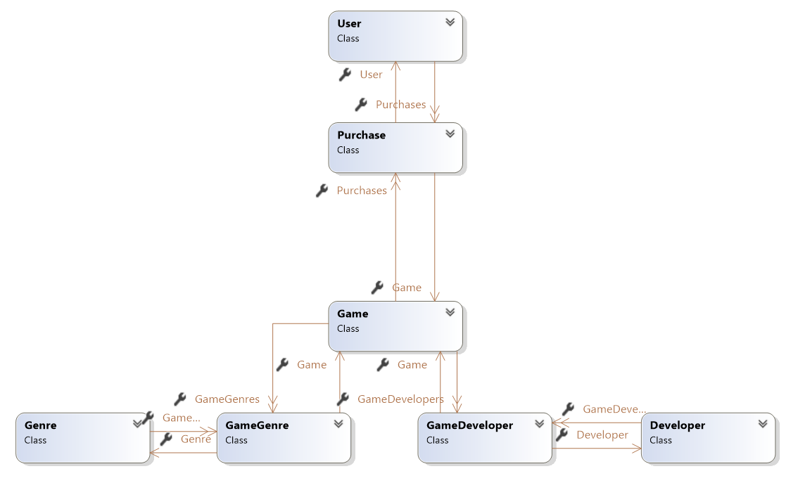

My 3-tier individual project for an online game’s marketplace

Project Goal:
The goal for my 3-tier application is to create a games marketplace where a user can create an account, allowing them to look through a store selection of games and "purchase" any they are interested in, which are then transferred for that user to their library where they would be able to view the game they acquired.

Additionally, an admin will be able to login to create new game entries for the store, as well as editing and delete current entries, as well as having some power to view and change registered accounts.

#### Definition of done:

Each task and user story added to the trello board is considered done when the code has been successfully implemented, tests has been run on it successfully and been approved in review.

#### Sprint Goal:

My goal for this sprint is to edit the documentation up to a higher standard and to include all the information neccessary, as well edit my trello board it reflects what is expected of the board

#### Project Retrospective:

##### What could have gone better:
-	Learning how to use WPF to implement my features took longer than I expected.
-	I sometimes spent too much time trying to get a feature working in a particular way which did not work.
-	Many of the features (e.g., setting game price) do not have features that handle exceptions from invalid values being added.
-	I started with more complex features, causing me to spend a lot of time trying to get those working before I realised, I should start on the simpler features and get those done first, so I do not end up wasting too much time on the areas I struggle on and not leaving enough time for the simpler tasks.
-	I started with model first but found I struggle to work with join tables with model first, and so restarted to implement database first which took additional time away from development.

#### Sprint Retrospective

##### What could be better:
-	A wallet function so users could add money to their wallet and only purchase games when they have enough money in their wallet.
-	Add a filter system for the store/library that allows the user to display games of certain genres.
-	Add a search bar that allows the user/admin to type in and see the game they search for
-	Enable the admin page to be only accessible by special admin accounts.
-	The application does not have much functionality other than allowing the user to purchase and view games.
-	Trello board was not utilised or organised correctly for sprint 1.

##### What went well:
-	I believe the functionality I have put in successfully works clearly and well.
-	I was able to finish a majority of the most important functionality.
-	I learned a lot about the functionality Entity Framework and WPF, and how to use them in conjunction with one another.

##### Action Plan:
-	Add other types of tasks to the sprint backlog (e.g. big fixing) other than user stories.
-	Create more defined order for creating the features, ahead of time.
- Work on the more simple/easier to implement features first.
- If I have struggle to get anywhere on implementing a feature, try working on a separate feature and come back later to the feature I'm struggling with.
 - Put required elements in trello board correctly at the beginning of the project.

#### Trello board - End of Sprint 1:

#### Trello board - Beginning of Sprint 2:

#### Trello board - End of Sprint 2:

#### User guide:
-	When the project is opened, connection between the database and model has already been setup, so to start using the application all the user needs to do is run the application with the WPF project as the start-up project.
-	From there the user can interact with the application as intended, first clicking on the “Create account” button to make an account for themselves, before navigating back to the login page where they can enter their account details and enter the application to access its full user features.

#### Class Diagram:

[Link to Trello board](https://trello.com/b/ieQGAace/3-layer-project)
